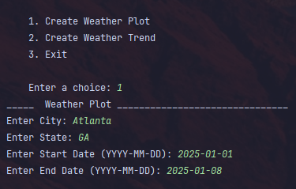
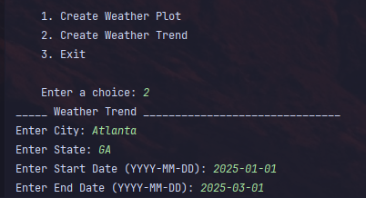

# Weather-Trend-Analyzer
A CLI/web app that fetches and stores weather data in an SQLite database to analyze temperature, humidity, and precipitation trends over time. Supports data visualization, historical comparisons, and trend forecasting.

## Installation
`git clone https://github.com/Zachdehooge/Weather-Trend-Analyzer.git` \
`python -m venv .venv` \
`pip install -r requirements.txt`\
`python main.py`

## Weather Plots

## Weather Trends

