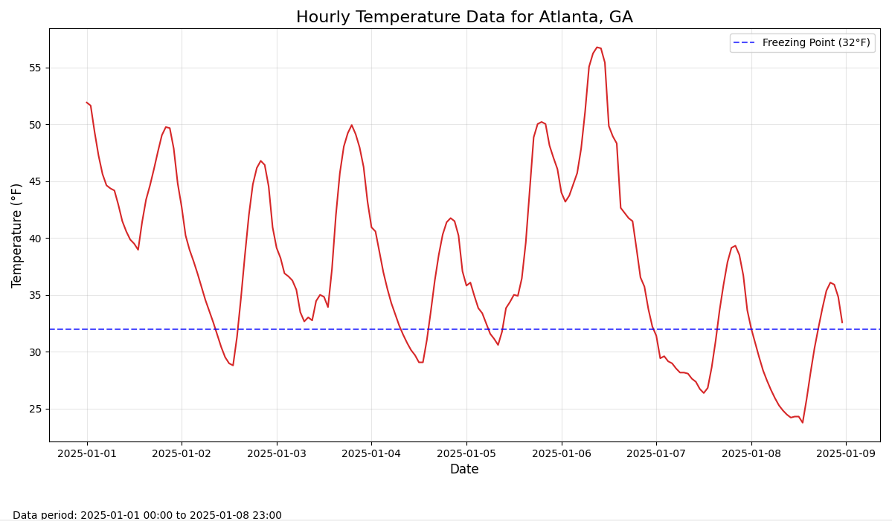

# Weather-Trend-Analyzer
A CLI app that fetches archived weather data and analyzes temperature, humidity, and precipitation trends over time

## Installation
`git clone https://github.com/Zachdehooge/Weather-Trend-Analyzer.git` \
`python -m venv .venv` \
`pip install -r requirements.txt`\
`python main.py`

## Weather Plots

## Weather Trends

